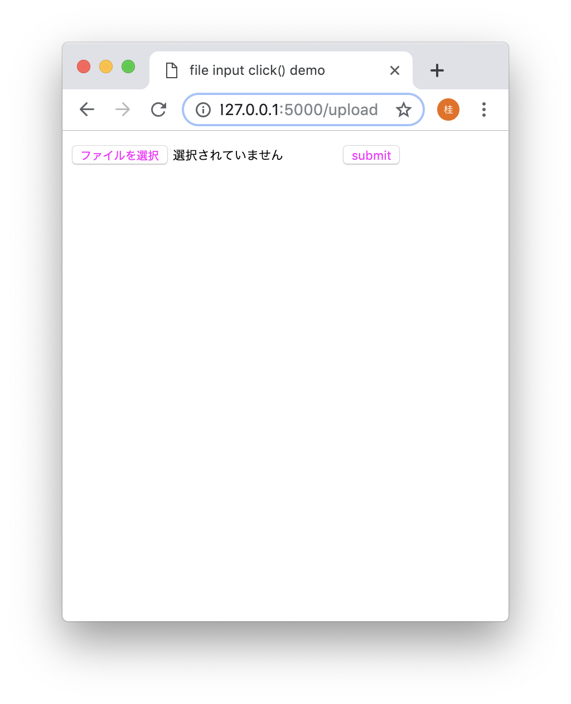
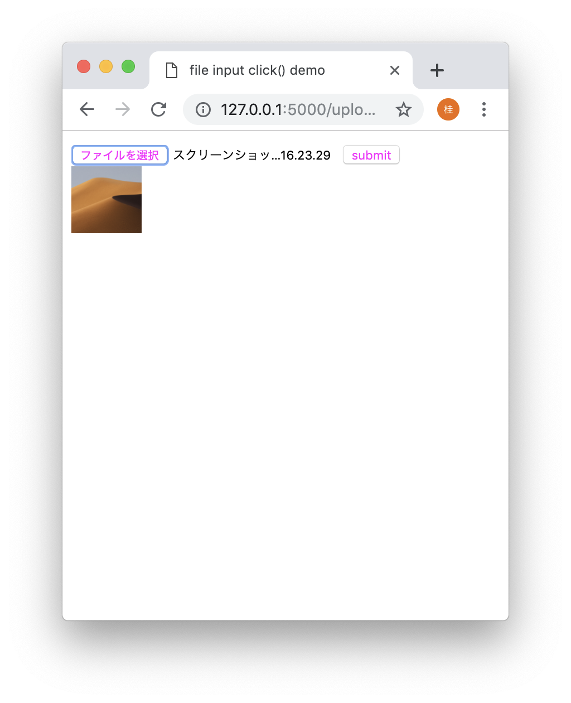

# ローカルにある画像ファイルをウェブにアップロードするアプリ




## 実行環境
PythonのFlaskフレームワークを利用。

http://flask.pocoo.org/

## 環境構築

1. 作業用ディレクトリの作成
```
mkdir myproject
cd myproject
python3 -m venv venv
```

2. 環境のアクティベート
```
. venv/bin/activate
```

3. pip コマンドを使ってFlaskをインストール
```
pip install Flask
```


## 実行

1. 環境変数の設定
```
export FLASK_APP=app.py
```

※デバッグモードで実行する場合は、
```
export FLASK_DEBUG=1
```

2. 実行
```
flask run
```
